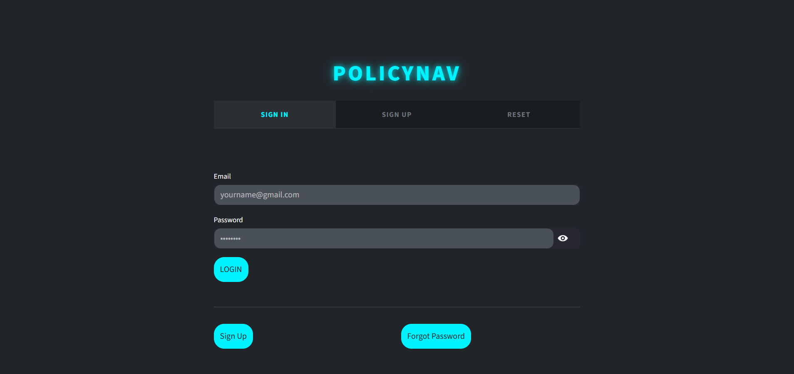
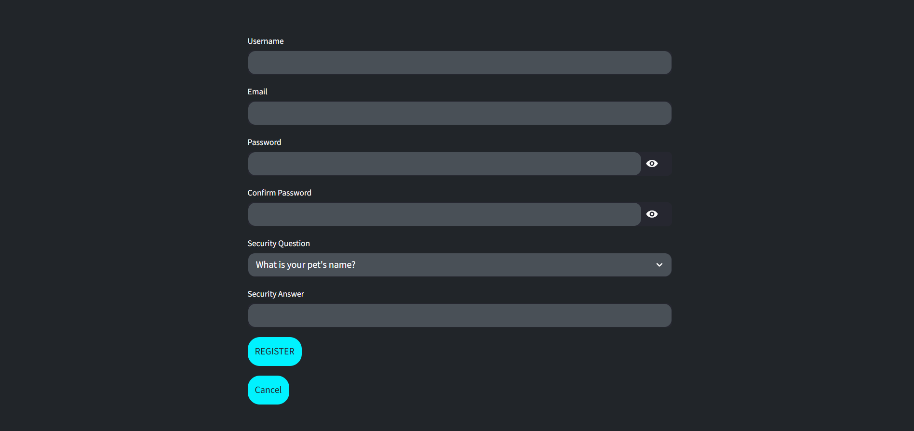
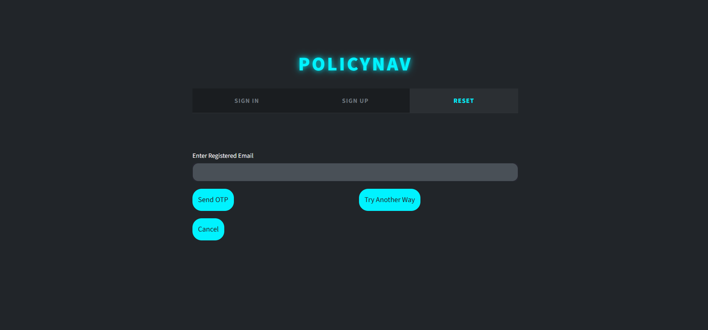

# 🚀 PolicyNav – Milestone 1

Milestone 1 focuses on establishing the **core foundation of the PolicyNav platform** by implementing a secure authentication system and preparing the application for online access. This stage ensures that users can safely register, log in, and interact with the platform while maintaining proper session management and data security.

The system is developed using **Streamlit for the interface**, **SQLite for data storage**, and **secure authentication mechanisms** such as password hashing and JWT-based session handling.

---

## 🔑 Core Features Implemented

### 1. Streamlit Application Interface
- Developed the initial **web-based interface using Streamlit**.
- Created a simple and responsive layout for authentication pages.

### 2. Secure User Authentication
- Implemented **user signup and login functionality**.
- User credentials are securely stored using **bcrypt password hashing** to prevent plain-text password storage.

### 3. JWT-Based Session Management
- Integrated **JSON Web Tokens (JWT)** to manage user sessions securely.
- Ensures authenticated access to protected parts of the application.

### 4. Database Integration
- Implemented a **SQLite database** for storing user data.
- Lightweight and efficient for early-stage application development.

### 5. Email Support
- Added **SMTP-based email functionality**.
- Enables sending authentication-related emails such as password reset or verification.

### 6. Security Measures
- Password hashing using **bcrypt**
- **Token-based authentication** with JWT
- Basic input validation to prevent incorrect or invalid data submission.

### 7. Public Deployment for Testing
- Used **ngrok** to expose the Streamlit application running in **Google Colab**.
- Generated a public URL so the application can be accessed externally during development.

---

## 🛠️ Technology Stack

| Component | Technology |
|----------|------------|
| Programming Language | Python |
| Frontend Framework | Streamlit |
| Database | SQLite |
| Authentication | JWT (PyJWT) |
| Password Security | bcrypt |
| Deployment Access | ngrok |
| Email Service | SMTP |

---

## Screenshots

---

## 🎯 Milestone Outcome

By the end of Milestone 1, the project successfully establishes the **authentication and infrastructure layer of PolicyNav**.  
Users can securely create accounts, log in to the system, and interact with the application through a web interface. This milestone lays the groundwork for future modules such as **policy document ingestion, AI-powered search, and intelligent policy analysis**.

---
