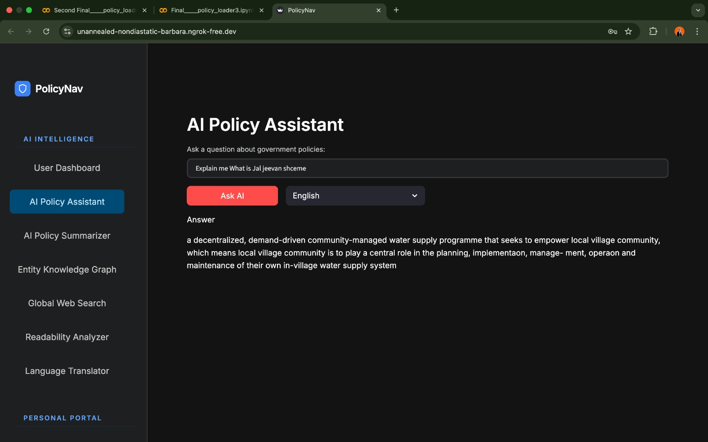
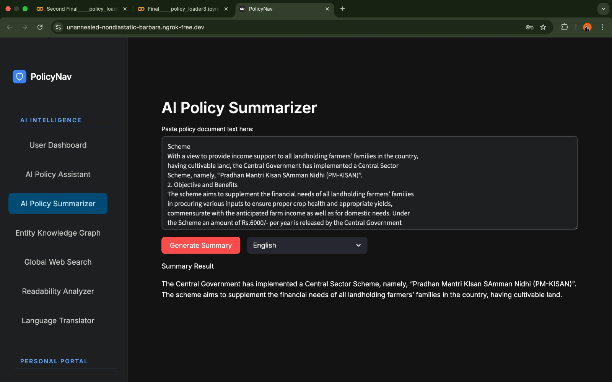
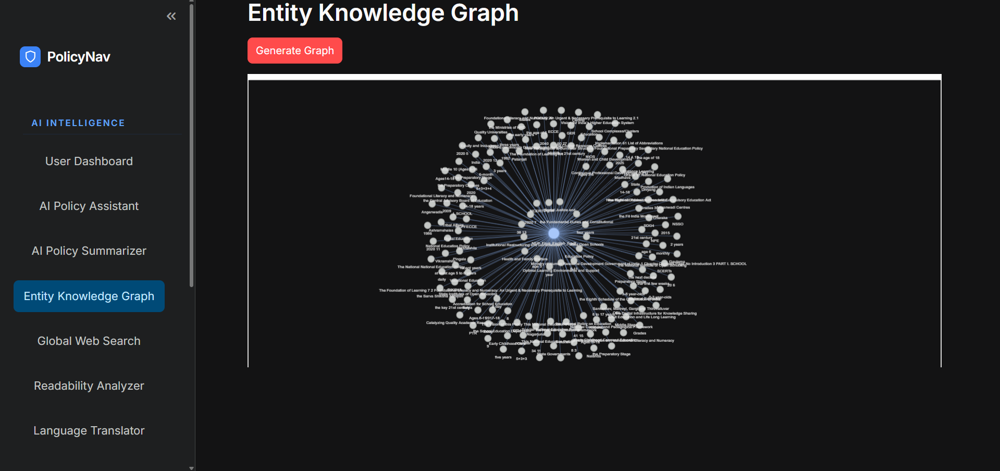
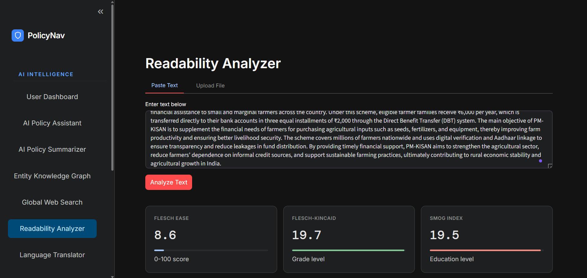
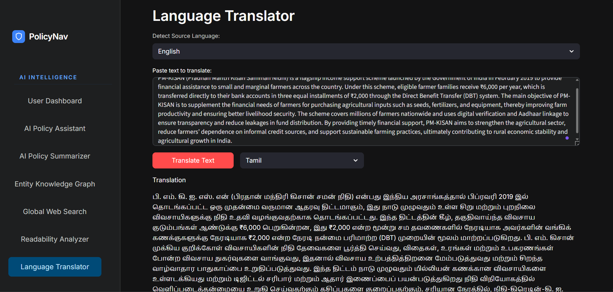
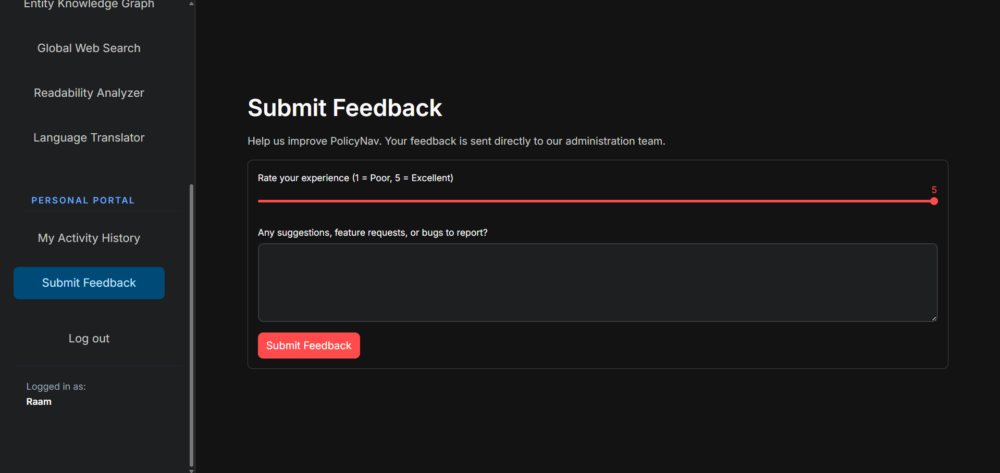
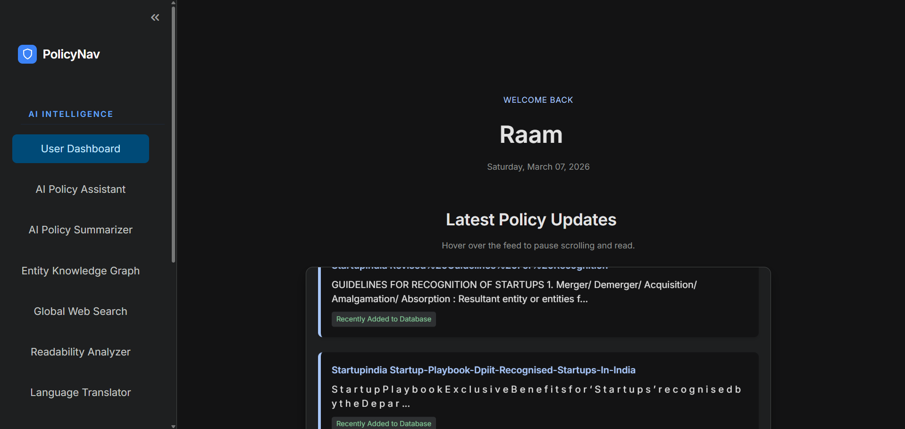
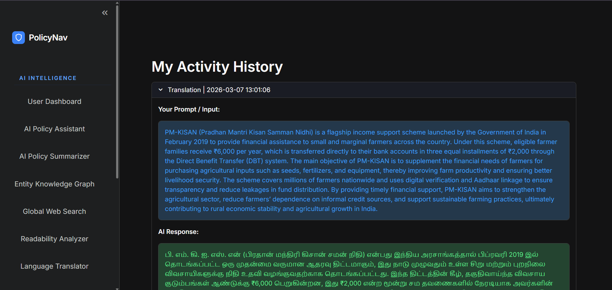

# 🚀 PolicyNav – Milestone 3

Milestone 3 significantly expands the capabilities of the **PolicyNav platform** by introducing AI-powered policy analysis, multilingual access, intelligent search, and enhanced user interaction features. These additions aim to make public policy documents easier to understand, analyze, and explore for a wider audience.

---

# ✨ Features Implemented

## 🌍 Multilingual RAG Question Answering
- Implemented a **Retrieval-Augmented Generation (RAG)** based question answering system.
- Users can ask questions about policy documents in multiple languages.
- The system retrieves relevant policy content and generates context-aware answers.

📸 RAG Q/A  

---

## 🧠 AI Policy Summarization
- Automatically generates **concise summaries of lengthy policy documents**.
- Helps users quickly understand key policy information without reading the entire document.
- Uses AI-based text summarization techniques.

📸 Summarization  

---

## 🕸 Entity Knowledge Graph
- Extracts key entities such as **organizations, policies, and related concepts**.
- Displays relationships between entities using an **interactive knowledge graph**.
- Enables users to visually explore connections between policies and stakeholders.

📸 Knowledge Graph  

---

## 📊 Text Readability Analyzer
- Evaluates how easy or difficult a policy document is to understand.
- Uses readability metrics to analyze sentence complexity and structure.
- Helps users assess whether policies are accessible to the general public.

📸 Readability  

---

## 🌐 Web Search Integration
- Allows users to perform **web-based searches related to policy topics**.
- Enhances policy exploration by retrieving relevant external information.

📸 Web Search  

---

## 🌎 Text Translator
- Provides automatic **text translation across multiple languages**.
- Enables users to read policy information in their preferred language.

📸 Text Translator  

---

## ⭐ User Feedback Portal
- Provides a **professional 5-star rating slider** for quick evaluation.
- Includes a **detailed text input field** for qualitative feedback.
- Implements strict validation to prevent empty or meaningless submissions.
  
📸 Feedback  

---

## 🛠 User Dashboard

📸 User Dashboard  

---

# 📜 Activity History Tracking
- Records user interactions and actions within the platform.
- Stores activity data such as queries, feedback submissions, and system usage.
- Helps administrators analyze user engagement and monitor system usage.

📸 Activity History  

---

# 🧰 Technologies Used

- Python  
- Streamlit  
- SQLite  
- FAISS (Vector Database)  
- Natural Language Processing (NLP)  
- Retrieval-Augmented Generation (RAG)  
- AI Text Summarization  
- Translation APIs

---

# 📌 Milestone Outcome

Milestone 3 transforms PolicyNav into a **fully interactive AI-powered policy exploration platform**. With multilingual question answering, policy summarization, knowledge graph visualization, readability analysis, translation, web search, and feedback systems, the platform now provides a comprehensive and intelligent environment for navigating complex public policy information.

---

